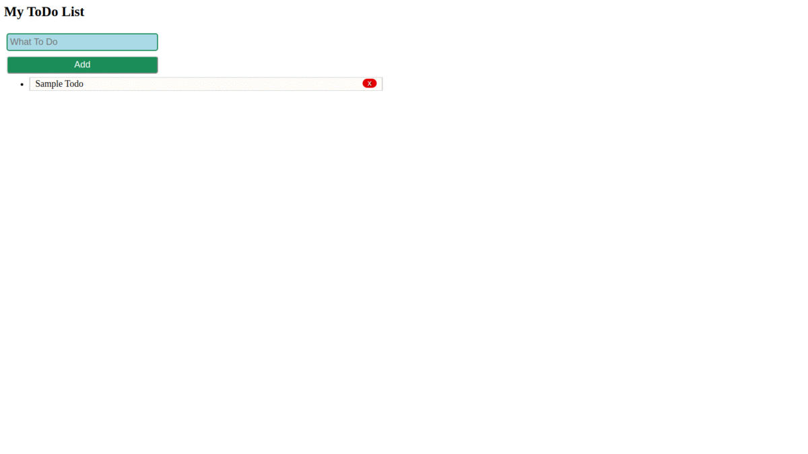

# Events and Dom excersizes
## 1. make following para invisible on button click by setting class by JS
``` <p class='blue'>Hello i am here</p> ```
## 2. replace Kuwait with Sydney with the help of JS
``` 
<div id='country'>
 <p>Pakistan</p>
 <p>Australia</p>
</div>
<div id='city'>
 <p>Karachi</p>
 <p>Kuwait</p>
</div>
```
## 3. Add in above code; Add USA in country list, add newyork in city list
## 4. disable right click on the webpage
## 5. Make a form with name, age and CNIC number. make JS validation function  form shoul submit only when  name, age, cnic is given. name is string. age and cnic is number
## 6. Store cnic value form above example and put dashes in CNIC number at right place  42401-22222222-0
# Dom excersizes
## 1. Make a todo list and add todo form and add new todo to list with delete and complete options

## 3. Make a following signup form


